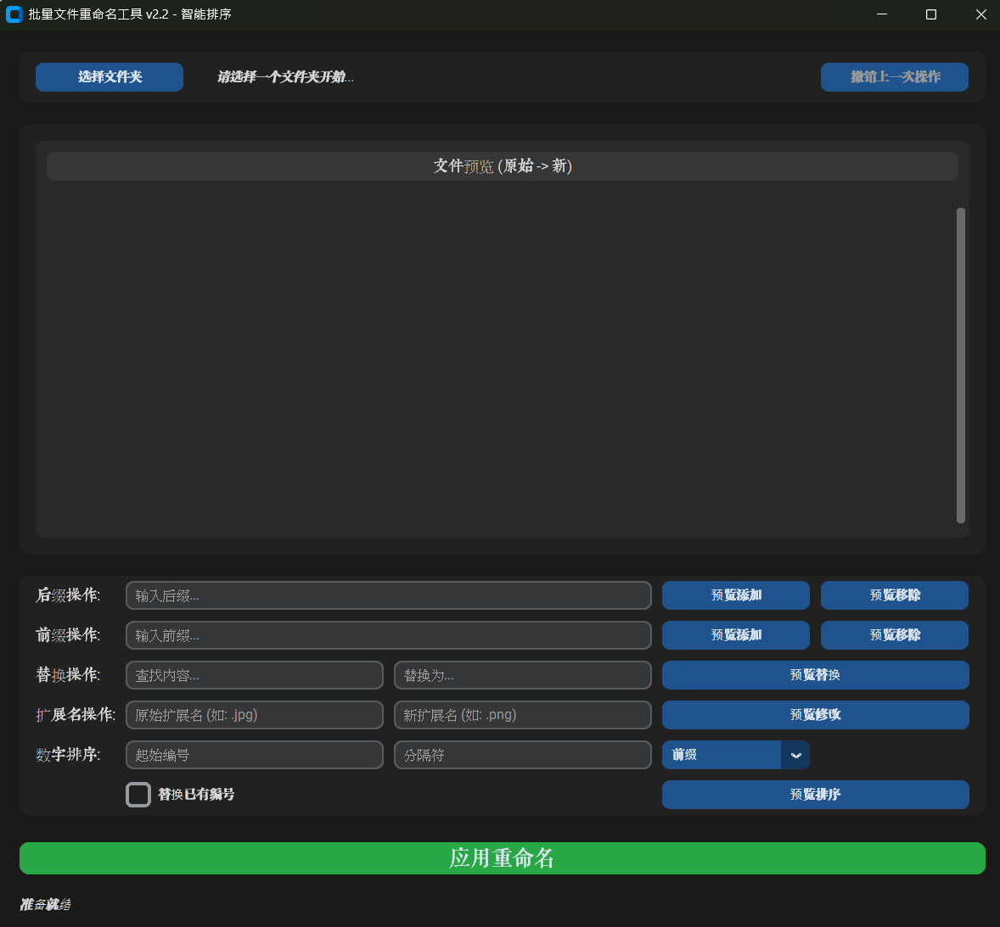

# 🎯 FileRenamerTool - 智能批量文件重命名工具

[](https://www.python.org/downloads/)
[](LICENSE)
[](https://www.microsoft.com/windows)

> 一个优雅、高效的批量文件重命名工具，支持多种重命名模式，提供实时预览和撤销功能。

## 📸 软件截图



*现代化的Material Design界面*

## ✨ 功能特性

- 🎨 **现代化界面** - 基于CustomTkinter的Material Design风格
- 🔄 **5种重命名模式** - 前缀/后缀、文本替换、扩展名修改、智能编号
- 👀 **实时预览** - 操作前预览重命名效果，避免误操作
- ↩️ **撤销功能** - 支持操作回滚，安全可靠
- 📁 **智能排序** - 自然排序算法，符合人类直觉
- 🌙 **主题切换** - 支持深色/浅色主题
- 🛡️ **安全机制** - 两阶段重命名，防止文件冲突

## 🚀 快速开始

### 系统要求

- Windows 10/11
- Python 3.9 或更高版本

### 安装方式

#### 方式一：下载预编译版本（推荐）

1. 前往 [Releases](https://github.com/Julian-cloud-max/FileRenamerTool/releases) 页面
2. 下载最新版本的 `FileRenamerTool.exe`
3. 双击运行即可使用

> ⚠️ **注意**：如果杀毒软件报告病毒，这是误报！请查看 [杀毒软件误报说明](ANTIVIRUS_FALSE_POSITIVE.md) 了解如何解决。

#### 方式二：从源码运行

```bash
# 1. 克隆项目
git clone https://github.com/Julian-cloud-max/FileRenamerTool.git
cd FileRenamerTool

# 2. 创建虚拟环境
python -m venv venv
venv\Scripts\activate

# 3. 安装依赖
pip install -r requirements.txt

# 4. 运行程序
python main.py
```

## 📖 使用指南

### 基本操作流程

1. **选择文件夹** - 点击"选择文件夹"按钮，选择需要重命名的文件所在目录
2. **选择操作类型** - 从5种重命名模式中选择一种
3. **设置参数** - 根据选择的模式输入相应参数
4. **预览效果** - 查看重命名预览，确认无误
5. **应用重命名** - 点击"应用重命名"按钮执行操作

### 重命名模式详解

#### 1. 前缀/后缀操作
- **前缀模式**：在文件名前添加指定文本
  - 示例：`photo.jpg` → `2024_photo.jpg`
- **后缀模式**：在文件名后添加指定文本
  - 示例：`photo.jpg` → `photo_风景.jpg`

#### 2. 文本替换
- 将文件名中的指定文本替换为新文本
- 示例：`IMG_001.jpg` → `photo_001.jpg`

#### 3. 扩展名修改
- 批量修改文件扩展名
- 示例：`.jpg` → `.png`

#### 4. 智能编号
- 为文件添加序号，支持多种格式
- 示例：`photo_001.jpg`, `photo_002.jpg`, `photo_003.jpg`

### 高级功能

#### 撤销操作
- 程序会自动记录所有重命名操作
- 点击"撤销操作"按钮可以回滚到上一个状态
- 撤销日志保存在程序目录下的 `undo_log.json` 文件中

#### 实时预览
- 所有操作都会实时显示预览效果
- 预览中会高亮显示变化的部分：
  - 🟡 金色：新增内容
  - 🔴 红色：删除内容
  - 🔵 蓝色：保持不变

## 🛠️ 开发指南

### 项目结构

```
FileRenamerTool/
├── main.py                    # 程序入口
├── app_ui.py                  # 主界面实现
├── requirements.txt           # 依赖包列表
├── README.md                 # 项目说明
├── LICENSE                   # 开源协议
├── CONTRIBUTING.md           # 贡献指南
├── .gitignore               # Git忽略文件
├── screenshots/             # 软件截图
│   └── main_interface.png   # 主界面截图
└── .github/                 # GitHub配置
    ├── workflows/           # GitHub Actions
    ├── ISSUE_TEMPLATE/      # Issue模板
    └── pull_request_template.md
```

### 技术栈

- **Python 3.9+** - 核心编程语言
- **CustomTkinter** - 现代化GUI框架
- **Tkinter** - 底层GUI支持
- **JSON** - 配置和日志存储

### 本地开发

```bash
# 1. Fork项目到你的GitHub账户
# 2. 克隆你的Fork
git clone https://github.com/Julian-cloud-max/FileRenamerTool.git
cd FileRenamerTool

# 3. 创建开发分支
git checkout -b feature/your-feature-name

# 4. 安装开发依赖
pip install -r requirements.txt

# 5. 运行程序
python main.py

# 6. 提交更改
git add .
git commit -m "feat: add new feature"
git push origin feature/your-feature-name

# 7. 创建Pull Request
```

## 🤝 贡献指南

我们欢迎所有形式的贡献！

### 如何贡献

1. **报告Bug** - 在 [Issues](https://github.com/Julian-cloud-max/FileRenamerTool/issues) 中创建新的Issue
2. **提出建议** - 在 [Discussions](https://github.com/Julian-cloud-max/FileRenamerTool/discussions) 中分享你的想法
3. **提交代码** - Fork项目并创建Pull Request
4. **改进文档** - 帮助完善README、注释等文档

### 代码规范

- 遵循PEP 8 Python代码规范
- 添加适当的注释和文档字符串
- 确保代码通过基本测试
- 提交信息使用清晰的描述

### 功能建议

如果你有新的功能想法，欢迎在Issues中提出！一些可能的方向：

- 🔍 正则表达式支持
- 📁 子文件夹递归处理
- 🎨 更多主题选项
- 📊 批量操作统计
- 🔗 云端配置同步

## 📄 开源协议

本项目采用 [MIT License](LICENSE) 开源协议。

## 🙏 致谢

感谢所有为这个项目做出贡献的开发者！

## 📞 联系我们

- **GitHub Issues**: [报告问题](https://github.com/Julian-cloud-max/FileRenamerTool/issues)
- **GitHub Discussions**: [讨论交流](https://github.com/Julian-cloud-max/FileRenamerTool/discussions)

---

⭐ 如果这个项目对你有帮助，请给我们一个Star！ 